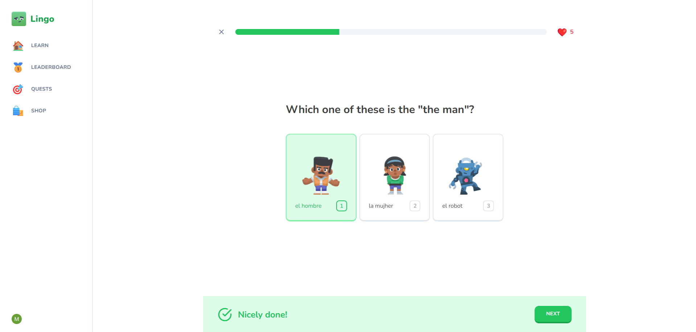

# 🧠 Language Learning SaaS

## 🌐 [Live Demo](duolingo-saas.vercel.app)
<a href="https://duolingo-saas.vercel.app">
  
  <p>Click to see the demo</p>
</a>

<br>

## 📋 Table of Contents

1. 📌 [Introduction](#-introduction)
2. ⚙️ [Tech Stack](#️-tech-stack)
3. ✨ [Features](#-features)
4. ⚡ [Quick Start](#-quick-start)
5. 🚧 [Future Enhancements](#-future-enhancements)
6. 🙌 [Feedback & Contributions](#-feedback--contributions)
7. 📬 [Contact](#-contact)

<br>

## 📌 Introduction

This is a language learning SaaS, I built from the ground up to help users learn new languages through interactive, gamified lessons.

The project contains modern technologies and best practices to deliver a clean, scalable architecture. From authentication and payment integration to lesson creation and progress tracking, every feature is custom-built to provide a seamless user experience.

<br>

## ⚙️ Tech Stack

- Next.js
- React
- TypeScript
- Tailwind CSS
- Shadcn/UI
- Stripe
- React Admin
- Neon Postresql
- Drizzle
- Clerk
- Zustand

<br>

## ✨ Features

- 🚀 **Built with Next.js App Router**  
  Structured with the latest routing, layouts, and loading strategies.

- 👤 **Authentication via Clerk**  
  Secure, production-ready user management.

- 🧠 **Interactive Learning System**  
  Users can go through dynamic lessons that include different question types and instant feedback.

- 🛠️ **Admin Dashboard with React Admin**  
  Fully functional dashboard for managing courses, content, and user data.

- 💳 **Stripe Integration**  
  Payments are integrated to unlock premium features or future subscriptions.

- 🧾 **Type-Safe ORM with Drizzle**  
  Clean, type-safe queries connected to a modern PostgreSQL setup on Neon.

- ⚡ **Instant Deployment via Vercel**  
  Fast CI/CD pipeline and global hosting for seamless delivery.

<br>

## ⚡ Quick Start

### 1. Clone the repository:

```bash
git clone https://github.com/programmersEmperor/Learning-SaaS.git
cd Learning-SaaS
```

### 2. Install dependencies:

```bash
npm install
```

### 3. Configure environment variables:

Create a `.env.local` file and include the following variables:

```bash
NEXT_PUBLIC_CLERK_PUBLISHABLE_KEY=
CLERK_SECRET_KEY=
NEXT_PUBLIC_CLERK_SIGN_IN_FORCE_REDIRECT_URL=
NEXT_PUBLIC_CLERK_SIGN_UP_FORCE_REDIRECT_URL=
NEON_DATABASE_URL=
STRIPE_API_KEY=
STRIPE_WEBHOOK_SECRET=
NEXT_PUBLIC_API_URL=
```

### 4. Start the development server:

```bash
npm run dev
```

Then open [http://localhost:3000](http://localhost:3000) in your browser.

<br>

## 🚧 Future Enhancements

- Personalized learning paths based on user performance  
- Streak tracking and gamification  
- Localization support  
- E2E and unit testing coverage  

<br>

## 🙌 Feedback & Contributions

This is a solo-built project created from scratch to demonstrate full-stack skills and product thinking. Suggestions and contributions are always welcome!

<br>

## 📬 Contact

Want to connect or collaborate? Reach out via :
- [LinkedIn](https://linkedin.com/in/mutasim-al-mualimi) 
- [Email](mailto:mutasim.business2020@gmail.com)
